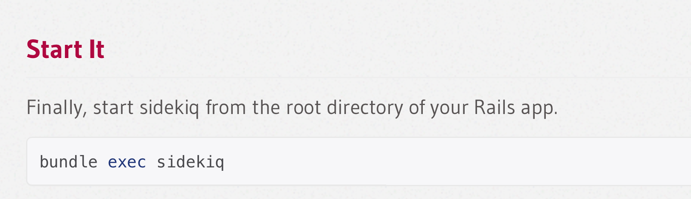
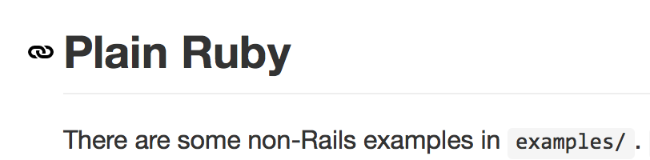
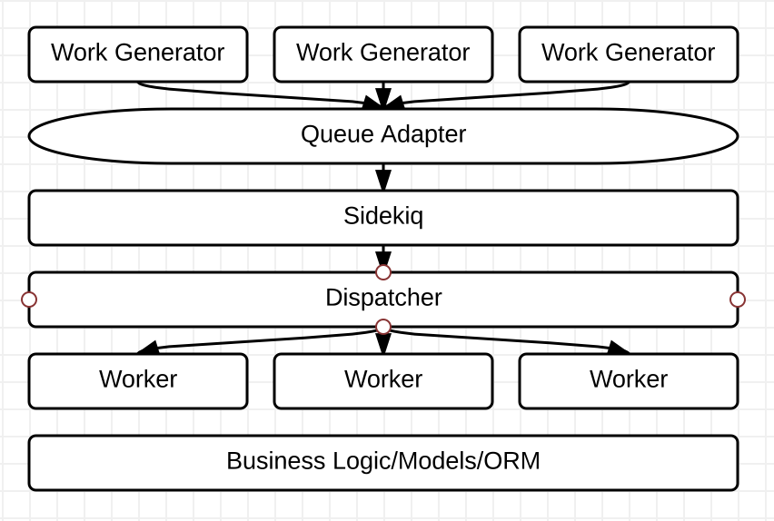
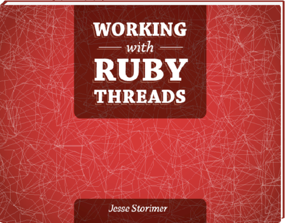

# Sidekiq and<br />Plain Old Ruby

Note:
- Who here uses Sidekiq?
- And who uses it entirely outside of Rails, using just PORO?
- It is not the common use case.


# For example


Note:
- Most of the Sidekiq documentation talks about it in terms of Rails


# But yet!



Note:
- So, it can be done.


# But&hellip;why?

Note:
- If Sidekiq is easy to use with Rails, And you know how to do Rails, why would you bother to do Sidekiq outside of Rails?


# Or, how to answer your boss' questions
## Such as
- What are you doing?
- Why are you doing that?
- When will you be done doing that?
- How will you even do that?
- Where are you getting lunch?


# Smaller Stack!

<br />
Credit: http://www.flickr.com/photos/64036275@N00/218632978

Note:
- A empty Rails app has 53 gems
  - Each of which has their own release cycle, issue list, tech debt, etc.
- Development of actual features will add probably a dozen gems
  - A JSON-API only rails app we developed ended up with 65 total gems.
  - So maybe a dozen is optimistic
- Our complete Sidekiq server has 30
  - And most of those are for testing and deployment
  - Remove those and we're left with 10 gems


# Fewer Tools!

<br />
Credit: https://www.flickr.com/photos/jdtornow

Note:
- Rails is an overstuffed Swiss army knife, chock full of tools.
- Think of all the ways you could hurt yourself in this workshop!
- Barring that, how much work it is to clean, organize and maintain that many options
- Rails lets you do a ton, but how many things do you really need in a Sidekiq worker?
  - Controllers?
  - Views?
  - XML Parsing?
  - Whatever the hell ActionCable is?
- Probably 80% of Sidekiq workers need a nothing more than a DB connection and a mail server


# Fewer Updates!


Note:
- Ruby is not a magical bug-free wonderland
- But it has fewer emergency patches than Rails.
- And its release cycle is not as aggressive.
- Code written in Ruby 2.2 is likely going to be supported for longer than something written in Rails 4.2


# ~~Entertainment~~<br />Learning!

<br />
Credit: https://www.flickr.com/photos/tamuc

Note:
- The code in Rails isn't magical.
- If you can write Ruby, you can write the exact same code
- It's pretty fun.
- And you learn a lot about Rails stuff you might otherwise take for granted
- Also, I want that sweet keyboard


# Thankfully,<br />it's really easy

```ruby
class PoroClient
  def self.run(message_count = 100)
    message_count.times do
      Sidekiq::Client.push('class' => 'PoroWorker','args' => [rand])
    end
  end
end

class PoroWorker
  include Sidekiq::Worker

  def perform(args)
    puts args
  end
end
```

Note:
- That's a working Sidekiq setup.
- Doesn't do anything but output random numbers, but still.
- Your work may be more complex
- If you do happen to need to write an app to output random-ish numbers, feel free to steal my code!
- But, likely, you need to do more.


# Our Approach



Note:
- It's so symmetrical and clean that it must be right!


# Work Generator
## Hey, I found some stuff for you to do

```ruby
def find_sad_kittens
  sad_kittens.each {|k| MessageAdapter.send({animal: "kitten", id: k.id}) }
end
```

Note:
- It totally does not matter what these are.
- we are using little daemons written with ruby
- But you could use cron, rake, other rails apps, whatever
- I've even seen Sidekiq interfaces written in other languages


# Queue Adapter
## Shh, it's a secret

```ruby
class MessageAdapter
  def self.send(message)
    Sidekiq::Client.push(
      'class' => 'Dispatcher',
      'args' => [message]
    )
  end
end
```

Note:
- Instead of having all generators know that your queue is Sidekiq and how to talk to it, have them use an adapter.
- Then when you ditch Sidekiq for something else, you only have to change your adapter.


# Sidekiq
## Magic Happens Here


# Dispatcher
## Who wants this work?

```ruby
class Dispatcher
  def perform(args)
    if args["animal"] == "kitten"
      KittenWorker.new(args).work
    end
  end
end
```

Note:
- We went with a single queue in Sidekiq, but we're putting in all different kinds of work.
- Instead of having the Work Generator know the name of the class that will handle the job, we have them all talk to the Dispatcher.
- The dispatcher then sends the job off to the right class or classes.
- This may be totally unnecessary for you.
- On the plus side, we can change who does the work without ever having to change or re-deploy the Work Generators
- And we got to write some fun code here, much better than the if statement I have in my example


# Worker
## Finally doing the work

```ruby
class KittenWorker
  def initialize(id)
    @kitten = Kitten.find(id)
  end

  def work
    until @kitten.happy?
      @kitten.pet
      @kitten.feed
    end
  end
end
```

Note:
- And now you can send that email, delete that record, whatever.


# Warning
## You might start to re-implement ActiveRecord

Note:
- You probably need to do something with a database in your code.
- And you're going to feel a junkie-like itch for ActiveRecord.


# Resist!
## Sample those other ORMs you keep hearing about
- Sequel: http://sequel.jeremyevans.net/
- Rom: http://rom-rb.org/
- Ohm: http://ohm.keyvalue.org/
- Plain SQL?

Note:
- We went with the Sequel library
- It's pretty sweet
- One set of classes define the business logic.
- Another set of classes manage persistence.
- We keep hearing that this is a good idea, so we're trying it.


# Or Don't
## No one will judge you

Note:
- Do you already have a ton of complex business logic in a bunch of ActiveRecord classes? Re-use them. Who cares? 


# ~~Roadbumps~~<br />Delightful Surprises

Note:
- Nothing is ever easy. Our project took about 4 weeks. 1 week to design the solution, 3 to implement. That was longer than expected.


# Testing


## Testing Sidekiq is easy
- Simple Mocking and Stubbing
- Run integration tests against a fake
- Or run against a real Sidekiq process


## Testing across a distributed system<br />is tricky
- A full CI environment can solve the problem
- Or contract tests shared by each component

Note:
- We have a shared collection of contract tests.
- I've also been playing with sending Protobuf objects through the queue, and it seems to work fine.
- This would allow you to define your Message as yet another PORO and ensure consistency across multiple services.


# Environments and Config
If you want the following, you'll have to write them

- A console
- Initializers
- Environment-specific configuration

Note:
None of this is painful, but they are niceties that Rails provides that you'll have to write (or steal from other projects)


# Asynchronicity and Multithreading


Note:
These aren't problems just for PORO setups, they are due to using Sidekiq


## You have no control

https://www.flickr.com/photos/zimpenfish

Note:
The first worker we wrote deletes records. And when I wrote the code that retrieved the record from the Database, I followed the ActiveRecord convention of raising an exception if the record is not found. 


## This is a bad idea

https://www.flickr.com/photos/oddwick

Note:
I don't know when this job will run. It's possible that the job is totally valid, but that some other job deletes the record first. Who knows?


## Job Creation != Job Execution

https://www.flickr.com/photos/pellaeon

Note:
The state of your data can change between these two events. Any assumption otherwise will surprise you.


## Mysteries of Multithreading


Note:
I found this book useful before even looking at Sidekiq. It's a good explanation of a part of Ruby that I think most of us avoid. I know I did.


# The power of poro
Simpler, more maintainable code<br />
<small>(Well, except for that ActiveRecord part)</small><br />
<br />


# Thanks!

- Twitter: iwhitney
- GitHub: IanWhitney
- Blather: http://designisrefactoring.com
